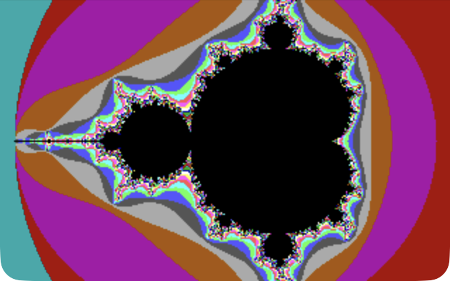
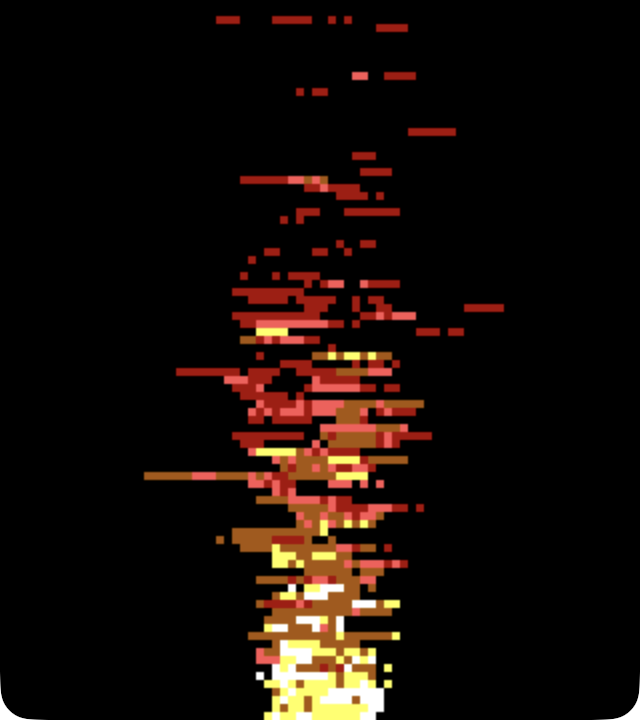
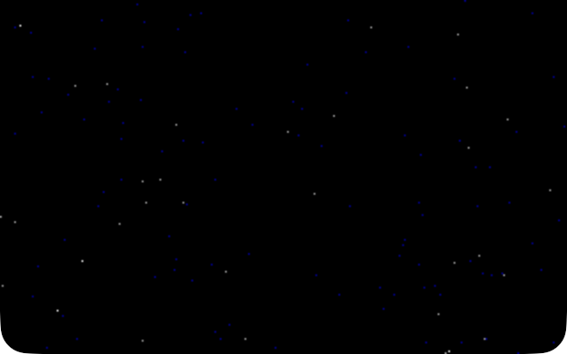
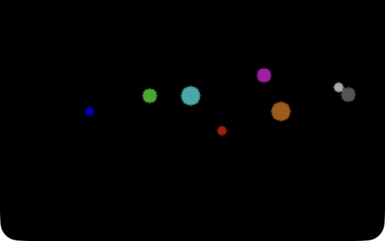
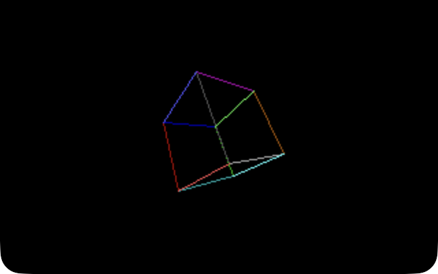
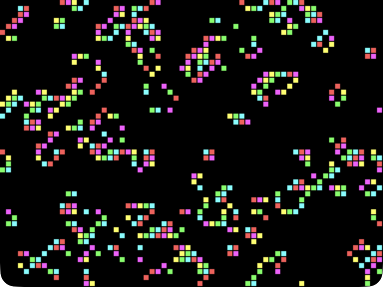
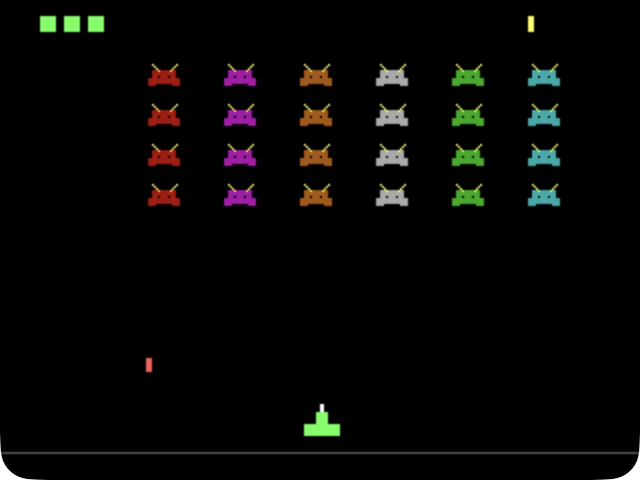

# BASIC09 Compiler Prototype

`basic09c` is an experimental standalone BASIC09 frontend that uses LLVM as a
library. It reads BASIC09 source, builds an AST, performs initial semantic
checks, and can lower the supported language subset to LLVM IR.

The compiler is target-independent. It does not depend on the MC6809 backend,
OS-9 runtime support, or an emulator.

This project is intentionally maintained outside the LLVM monorepo. It consumes
LLVM through LLVM's CMake package and links against LLVM as a normal external
dependency.

## Build

Point CMake at an LLVM build or install tree that provides `LLVMConfig.cmake`:

```sh
cmake -S . -B build -G Ninja \
  -DLLVM_DIR=/path/to/llvm/lib/cmake/llvm \
  -DCMAKE_BUILD_TYPE=Release

ninja -C build basic09c
```

For example, with Homebrew LLVM on macOS:

```sh
cmake -S . -B build -G Ninja \
  -DLLVM_DIR="$(brew --prefix llvm)/lib/cmake/llvm" \
  -DCMAKE_BUILD_TYPE=Release
```

The compiler is written to:

```sh
build/bin/basic09c
```

## Usage

```sh
build/bin/basic09c --dump-tokens path/to/program.b09
build/bin/basic09c --dump-ast path/to/program.b09
build/bin/basic09c --syntax-only path/to/program.b09
build/bin/basic09c --analyze-only path/to/program.b09
build/bin/basic09c --dump-symbols path/to/program.b09
build/bin/basic09c --format path/to/program.b09
build/bin/basic09c --emit-llvm path/to/program.b09
build/bin/basic09c --compile -o program path/to/program.b09
```

`--compile` emits LLVM IR internally, generates a small `main` wrapper for the
first BASIC09 procedure, and invokes a host C compiler to produce a native
executable. Use `--cc` to choose the compiler:

```sh
build/bin/basic09c --compile --cc clang -o program path/to/program.b09
```

## Optional SDL Graphics Runtime

`basic09c` has an experimental SDL2 runtime for simple host graphics. The
parser treats these as normal BASIC09 `RUN` calls; the IR lowering recognizes a
literal `sdl` command and `--compile --sdl` links the small SDL runtime.

```basic09
PROCEDURE demo
DIM quit,key:INTEGER
RUN sdl("open",320,200)

REPEAT
RUN sdl("poll")
quit:=sdl("quit")
key:=sdl("key")
RUN sdl("clear",0)
RUN sdl("line",10,10,310,190,15)
RUN sdl("pset",160,100,12)
RUN sdl("present")
RUN sdl("delay",16)
UNTIL quit<>0 OR key=27

RUN sdl("close")
END
```

Build it with:

```sh
build/bin/basic09c --compile --sdl --cc clang -o demo demo.b09
```

Then run the executable normally to open a visible SDL window:

```sh
./demo
```

There is also a converted SDL Invaders demo:

```sh
build/bin/basic09c --compile --sdl --cc clang -o sdl-invaders test/sdl-invaders.b09
./sdl-invaders
```

Controls are `A`/`D` to move, Space to fire, and Escape to quit.

### Demos

| | |
|---|---|
|  [`test/sdl-mandelbrot.b09`](test/sdl-mandelbrot.b09) — zoomable Mandelbrot set fractal |  [`test/sdl-fire.b09`](test/sdl-fire.b09) — classic Doom-style fire simulation |
|  [`test/sdl-plasma.b09`](test/sdl-plasma.b09) — animated sine-wave plasma |  [`test/sdl-starfield.b09`](test/sdl-starfield.b09) — 3D perspective starfield |
|  [`test/sdl-balls.b09`](test/sdl-balls.b09) — physics demo with gravity and elastic collisions |  [`test/sdl-cube.b09`](test/sdl-cube.b09) — rotating wireframe cube |
|  [`test/sdl-life.b09`](test/sdl-life.b09) — Conway's Game of Life |  [`test/sdl-invaders.b09`](test/sdl-invaders.b09) — Space Invaders clone |

Each of these builds and runs the same way:

```sh
build/bin/basic09c --compile --sdl --cc clang -o sdl-fire test/sdl-fire.b09
./sdl-fire
```

The lit tests use `SDL_VIDEODRIVER=dummy` for headless smoke coverage, so those
test runs intentionally do not display a window.

`sdl("poll")` is the only SDL command that drains the event queue and updates
`sdl("quit")` or `sdl("key")`; BASIC09 code owns the event loop.

The `--sdl` option requires SDL2 development flags from `sdl2-config` or
`pkg-config --cflags --libs sdl2`. On macOS with Homebrew:

```sh
brew install sdl2
```

## Tests

Run the standalone test suite with:

```sh
ninja -C build check-basic09c
```

Most tests only need `basic09c` plus LLVM test utilities such as `FileCheck`,
`split-file`, and `not`.

The optional MAME/CoCo 3 tests run only when MAME, Toolshed `os9`, and a usable
CoCo 3 ROM path are available:

```sh
MAME_ROM_PATH=/path/to/mame/roms \
  ninja -C build check-basic09c
```

## Source Layout

- `src/Basic09Token.*`: token kinds and token helpers
- `src/Basic09Lexer.*`: source normalization and lexing
- `src/Basic09AST.*`: AST node definitions and AST dumping
- `src/Basic09Parser.*`: recursive-descent parser
- `src/Basic09Semantic.*`: initial semantic checks
- `src/Basic09Symbols.*`: symbol collection and dumping
- `src/Basic09IR.*`: LLVM IR lowering
- `src/basic09c.cpp`: command-line driver
- `test/`: lit tests and BASIC09 sample inputs

## Status

Implemented pieces include source normalization, lexing, parsing, AST dumps,
semantic checks, symbol dumps, and LLVM IR emission for a useful subset of
BASIC09. Runtime behavior is prototype quality and intentionally small.
